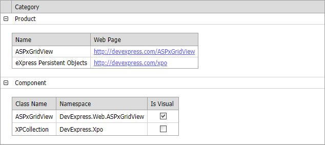

<!-- default badges list -->

[](https://supportcenter.devexpress.com/ticket/details/E1054)
[](https://docs.devexpress.com/GeneralInformation/403183)
<!-- default badges end -->

# Grid for ASP.NET Web Forms - How to conditionally display a detail grid
<!-- run online -->
**[[Run Online]](https://codecentral.devexpress.com/128538518/)**
<!-- run online end -->

This example demonstrates how to dynamically change visibility of an [ASPxGridView](https://docs.devexpress.com/AspNet/DevExpress.Web.ASPxGridView) control in the [DetailRow](https://docs.devexpress.com/AspNet/DevExpress.Web.GridViewTemplates.DetailRow) template. 



The template contains two grids whose visibility depends on the value of the master row.

```aspx
<dx:ASPxGridView ID="gridMaster" runat="server" AutoGenerateColumns="False" KeyFieldName="ID" Width="634px">
    <Templates>
        <DetailRow>
            <dx:ASPxGridView ID="gridProduct" Visible='<%# IsGridProductVisible(Container.KeyValue) %>' ... />
            <dx:ASPxGridView ID="gridComponent" Visible='<%# IsGridComponentVisible(Container.KeyValue) %>' ... />
        </DetailRow>
    </Templates>
  ...
</dx:ASPxGridView>
```
```cs
protected bool IsGridProductVisible(object categoryID) {
    object categoryName = gridMaster.GetRowValuesByKeyValue(categoryID, "Category");
    return "Product".Equals(categoryName);
}
protected bool IsGridComponentVisible(object categoryID) {
    object categoryName = gridMaster.GetRowValuesByKeyValue(categoryID, "Category");
    return "Component".Equals(categoryName);
}
```

## Files to Review

* [Default.aspx](./CS/ConditionalDetailRowTemplate/Default.aspx) (VB: [Default.aspx](./VB/ConditionalDetailRowTemplate/Default.aspx))
* [Default.aspx.cs](./CS/ConditionalDetailRowTemplate/Default.aspx.cs) (VB: [Default.aspx.vb](./VB/ConditionalDetailRowTemplate/Default.aspx.vb))
